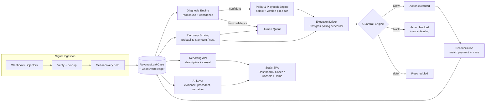
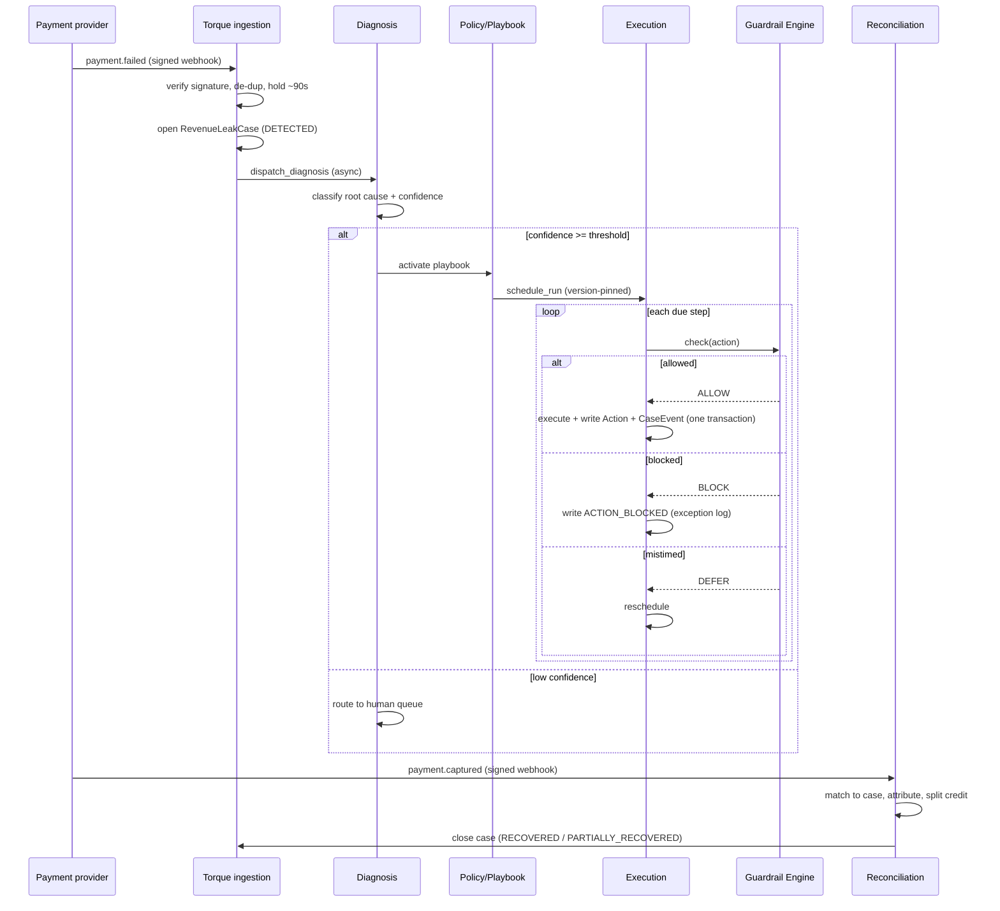
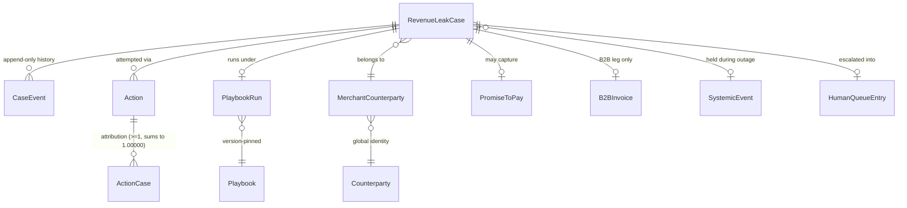
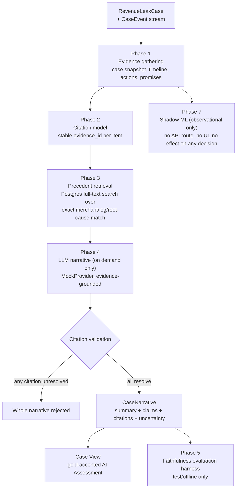

# Torque

**An autonomous revenue-recovery operating system.** When money that should
have arrived doesn't — a card declines, a subscription auto-charge fails, a
checkout is abandoned, a B2B invoice goes overdue — Torque detects it,
diagnoses why, prioritizes it economically, runs a bounded and
compliance-gated recovery playbook, reconciles the money that comes back, and
explains all of it — to an operator, and to an AI-assisted reviewer — with
citation-grounded evidence, never a black box.

```
REVENUE AT RISK → AI / DECISIONING → RECOVERY PRIORITY → GUARDRAILS → ACTION → RECOVERY → ₹ MONEY RECOVERED
```

Every stage above is a real, running subsystem, not a slide. This document
describes the system as it exists in this repository today.

---

## Table of contents

- [Why Torque exists](#why-torque-exists)
- [System architecture](#system-architecture)
- [The recovery decision flow](#the-recovery-decision-flow)
- [Domain model](#domain-model)
- [The AI layer](#the-ai-layer)
- [Frontend architecture](#frontend-architecture)
- [Backend architecture](#backend-architecture)
- [API surface](#api-surface)
- [Demo architecture](#demo-architecture)
- [Setup](#setup)
- [Testing](#testing)
- [Documentation map](#documentation-map)
- [Known limitations & tradeoffs](#known-limitations--tradeoffs)

---

## Why Torque exists

Every business that bills customers loses a slice of revenue to payment
friction that is *recoverable* but rarely recovered systematically: a card
declines, a subscription auto-debit fails, a checkout drops at the payment
step, a B2B invoice goes overdue. Merchants today stitch together a retry
tool, a dunning tool, and a manual collections process — four dashboards, four
definitions of "recovered," no shared customer view, and automation that
doesn't know when a card network, RBI, or WhatsApp rule makes an action
illegal rather than just inconvenient.

Torque closes that loop with **one shared case object across all four
funnels**, a **compliance engine that makes non-compliant automation
structurally impossible** (not just discouraged), and **honest attribution**
— it reports only the money it can prove it caused, and shows every case it
deliberately did *not* touch, by rule.

Full product narrative, worked examples, and pitch-ready language:
[`learning_log.md`](learning_log.md).

## System architecture



Nine deployable concerns, each owned by exactly one package under
`src/torque/`:

| Concern | Package | Owns |
|---|---|---|
| Ingestion | `ingestion/` | Signature verification, idempotency, the self-recovery hold, cross-leg merge, outage detection |
| Diagnosis | `diagnosis/` | Root-cause classification + confidence, human routing below threshold |
| Policy | `policy/` | Playbook catalog, selection, version-pinned run instantiation |
| Execution | `execution/` | The durable Postgres-polling step driver, guardrail consultation, atomic action+audit writes |
| Compliance | `compliance/` | Pure predicates: card/UPI/NACH retry budgets, RBI pre-debit notice, WhatsApp consent/template gates |
| Coordination | `coordination/` | Cross-case outreach discipline, escalation ceiling, the human queue |
| Reconciliation | `reconciliation/` | Matching a payment-success signal back to its case, attribution, credit-splitting |
| Scoring | `scoring/` | `(probability × amount at risk) ÷ expected cost`, cold-start + warm-start |
| Reporting | `reporting/` | Descriptive metrics + Module 9b causal/incrementality measurement |
| Agent Console | `agent_console/` | Human overrides: resolve / pause / unpause |
| AI | `ai/` | Evidence gathering, precedent retrieval, LLM narrative, faithfulness evaluation, shadow ML (see [The AI layer](#the-ai-layer)) |
| API | `api/` | FastAPI routers + the static UI mount |

State transitions live in one place — `state_machine.py` — and flush-time
invariants are enforced by `models/guards.py`. Neither has drifted since
Module 1 (`git diff` against the initial commit for both is still empty).

## The recovery decision flow



## Domain model



`RevenueLeakCase` is the one shared record across all four legs (payment
degradation, checkout abandonment, subscription/mandate failure, B2B
receivable). `CaseEvent` is the **only** history mechanism — append-only,
trigger-and-guard enforced, and the same stream that both the audit trail and
the AI layer's evidence read from. Every `Action` is written together with its
`CaseEvent` in one transaction (`write_action_and_event`) — an action can
never exist without its own audit entry.

## The AI layer

Torque's AI is **decision support layered onto a deterministic system it
cannot see or influence**, not a component the deterministic system depends
on. `torque.ai` has a structurally enforced forbidden-import boundary
(`tests/test_ai_boundary.py`): it cannot import `torque.state_machine`,
`torque.execution`, or anything that could let it write case state. Every
route in `torque.ai`/`torque.api.ai` is `GET`-only.



| Phase | What it does | Where |
|---|---|---|
| 0 | Package boundary + feature flag + a static test that fails the build if the boundary is ever crossed | `tests/test_ai_boundary.py` |
| 1 | Gathers case evidence (snapshot, timeline, actions, promises, counterparty relationship) — read-only, tenant-scoped | `ai/evidence.py` |
| 2 | Gives every evidence item a stable `source_type:source_id` citation id | `ai/schemas.py`, `ai/citations.py` |
| 3 | Finds comparable resolved cases for the *same* merchant via Postgres full-text search over an exact `(leg_type, root_cause_code)` filter — no vector DB, no embeddings (unjustified at this corpus size) | `ai/retrieval.py` |
| 4 | Generates a citation-grounded `CaseNarrative` **on demand only** (never on page load, never polled); rejects the whole narrative if any citation fails to resolve | `ai/narrative.py`, `ai/providers/` |
| 5 | A deterministic (no LLM, no embeddings) faithfulness/citation-coverage evaluation harness — test/offline tooling, not an API | `ai/evaluation.py` |
| 6 | Exposes Phase 4 through one read-only route, surfaced in the canonical Case View | `api/ai.py` |
| 7 | An **observational-only** shadow ML classifier (features from existing evidence) — no API route, no UI surface, no effect on any real decision | `ai/shadow/` |
| 8 | Adversarial/failure-mode hardening: timeout enforcement, malformed-id guards, a generic-500 catch-all, citation-context isolation | see `documentation/ai-memory/MILESTONES.md` §10b |

**The one concrete LLM integration is `MockProvider`** (`ai/providers/mock_provider.py`)
— deterministic, offline, zero network calls, zero API key. It is not a stub
that fakes an answer: it parses the real evidence payload and builds a
narrative whose citations resolve against that evidence exactly as a real
provider's would, so every test that exercises "the citation ids correspond
to the supplied evidence" is a genuine assertion, not a tautology. Swapping in
a real network-backed provider is a one-function change (`_get_provider()` in
`api/ai.py`); nothing else in the codebase branches on provider identity. See
`documentation/ai-memory/AI_BLUEPRINT.md` (D-AI-03) for why that swap is
deliberately not made in this program (a paid API key/budget decision,
explicitly out of the free-tier build constraint).

**What is never shown, on purpose:** a fabricated AI confidence score, the
Phase 5 evaluation report, or the Phase 7 shadow-ML prediction. None of these
have a UI surface today, and none are invented for demo polish — see
`documentation/UIX_BLUEPRINT.md` §26.

## Frontend architecture

**Hand-written HTML/CSS/vanilla JavaScript, no framework, no build step** —
`src/torque/ui/static/{index.html,torque.css,torque.js}`, served as static
files by the same FastAPI process on the same port as the API. This was a
deliberate choice, reassessed twice during this project (see
[`documentation/UIX_BLUEPRINT.md`](documentation/UIX_BLUEPRINT.md) and
[`documentation/demo/ARCHITECTURE.md`](documentation/demo/ARCHITECTURE.md)):
every interaction the UI needs — hover-driven charts, progressive disclosure,
citation anchoring, a real-time demo feed — is achievable in vanilla
JS/inline-SVG, so a framework migration would have spent effort on tooling
instead of the product itself, and would add a build step to what is
otherwise a one-command, offline-runnable demo.

The frontend renders **backend data only** — it computes no metric, score, or
ranking of its own (a standing test, `tests/test_module10_ui.py`, asserts this
by scanning the shipped JS for exactly that). Five screens: Dashboard, Cases,
canonical Case View (`#/cases/:id`, aliased at `#/console/:id`), Agent
Console, Live Demo.

## Backend architecture

Python 3.11 · FastAPI + uvicorn · SQLAlchemy 2.0 · Alembic · Pydantic v2 ·
Celery + Redis (**broker transport only** — no result backend, no durable
state) · PostgreSQL 16 · `uv` · pytest · ruff. One `Dockerfile`, reused for
the `api` / `worker` / `beat` processes.

Five runtime processes: **PostgreSQL** (the only durable source of truth),
**Redis** (Celery broker), **api** (`python -m torque` — FastAPI + the static
UI, one port), **worker** (executes every `torque.*` Celery task), **beat**
(the repeatable-timer trigger only: systemic-outage detection every 60s, the
execution poll every 10s/60s, a daily recovery-score recompute).

## API surface

All routers live under `src/torque/api/`, each with its own `_require_merchant`
tenant guard:

| Router | Prefix | Contract |
|---|---|---|
| `webhooks.py` | `/webhooks` | Signed provider webhooks (Razorpay-shaped) |
| `checkout_injection.py` | `/checkout` | Signed internal injection (no native webhook for cart abandonment) |
| `reporting.py` | `/reports/{merchant_id}` | Descriptive + causal reporting, case list/detail, human queue, activity feed |
| `agent_console.py` | `/agent-console/{merchant_id}` | `resolve` / `pause` / `unpause` — the only three human overrides |
| `ai.py` | `/ai/{merchant_id}` | `GET /cases/{case_id}/explain` — the single AI route, gated by `AISettings.enabled` (default `False`) |
| `demo.py` | `/demo` | Seed, scenario injection, merchant bootstrap |
| `health.py` | `/health`, `/health/ready` | Liveness / readiness (DB + Redis reachability) |
| `ui.py` | `/ui` | Static file mount |

## Demo architecture

The Live Demo screen (`#/demo`) runs the **real** ingestion, diagnosis,
guardrail, and reconciliation code — every scenario button calls
`POST /demo/inject/{key}` against `torque.demo.scenarios.inject_scenario`,
which composes existing production functions (`create_or_attach_case`,
the compliance predicates, `write_action_and_event`) into one visible event.
Nothing is faked or pre-recorded. Full flow, script, and feature-by-feature
walkthrough: [`documentation/demo/`](documentation/demo/).

## Setup

```bash
# 1. infrastructure
docker compose up -d db redis        # Postgres :5442, Redis :6389 (offset ports)

# 2. environment
uv sync                              # or: python -m venv .venv && pip install -e ".[dev]"
cp .env.example .env                 # fill secrets only if you need the webhook / injection paths

# 3. schema
uv run alembic upgrade head          # -> 0018_escalation_resolution

# 4. run the app (API + UI on http://127.0.0.1:8000)
uv run python -m torque
#    (Celery, if needed:  uv run celery -A torque.ingestion.celery_app:celery_app worker
#                         uv run celery -A torque.ingestion.celery_app:celery_app beat)

# 5. seed demo data (from the UI: Live Demo -> Seed demo data, or:)
curl -X POST "http://127.0.0.1:8000/demo/seed?reset=true"
```

To turn on the AI layer (off by default — `AISettings.enabled: bool = False`):

```bash
TORQUE_AI_ENABLED=true uv run python -m torque
```

### Run the full stack in containers

```bash
cp .env.example .env
docker compose --profile full up --build
```

Brings up `db + redis + migrate + api + worker + beat`. `migrate` runs
`alembic upgrade head` once; `api` waits for it, then serves
`http://127.0.0.1:8000` (`/` → `/ui/`, `/health`, `/health/ready`). A bare
`docker compose up` (no `--profile full`) still starts only `db` + `redis`.

## Testing

```bash
uv run pytest        # 1436 tests, Postgres-backed (creates/uses torque_test),
                      # skips cleanly with an explanatory message if no server
                      # is reachable at TEST_DATABASE_URL
uv run ruff check .
```

## Documentation map

| Document | Purpose |
|---|---|
| [`learning_log.md`](learning_log.md) | Pitch-ready product knowledge — explain any capability to an investor, customer, or judge without opening the code |
| [`documentation/demo/`](documentation/demo/) | Judge-facing demo flow, script, feature list, and technical report |
| [`documentation/UIX_BLUEPRINT.md`](documentation/UIX_BLUEPRINT.md) | The frontend design system and its rationale |
| [`documentation/ai-memory/`](documentation/ai-memory/) | Engineering continuation memory (architecture, decisions, milestones, invariants) — written for an agent or engineer resuming work, not for a judge |
| [`Torque_Blueprint_v7_FullSystem.md`](Torque_Blueprint_v7_FullSystem.md) | The original backend specification (Modules 1–13) |

## Known limitations & tradeoffs

- **The executor is a stub.** Torque schedules, guards, and records every
  action correctly, but no message/charge/payment-link is actually delivered
  externally — this is a deliberate, documented scope boundary (safe by
  construction), not an oversight.
- **`Action.cost` is largely unpopulated** — cost-efficiency figures using it
  are directionally correct but not yet fully priced.
- **No real LLM provider is wired in** (`MockProvider` only) — see
  [The AI layer](#the-ai-layer) for why, and the one-function seam that
  changes it.
- **Promise-evidence citation anchoring is inert** — `PROMISE_CAPTURED` is
  modeled but no execution path emits it yet, so a `promise:<id>` citation
  currently falls back to an honest "not shown in this view" rather than a
  resolvable anchor.
- **No real-time push** — the Live Demo feed polls every 3 seconds; this is a
  documented deliberate choice at this scale, not a gap.
- Frontend and backend are both single-tenant-per-process from a scaling
  standpoint (multi-tenant *data* isolation is enforced; horizontal scaling of
  the API/worker processes themselves is not this project's concern at
  hackathon scope).

## Version control

The **maintainer performs all Git operations.** Contributors (human or agent)
never `commit`, `push`, or otherwise write to Git — see
[`documentation/ai-memory/CONTINUATION_PROTOCOL.md`](documentation/ai-memory/CONTINUATION_PROTOCOL.md).
