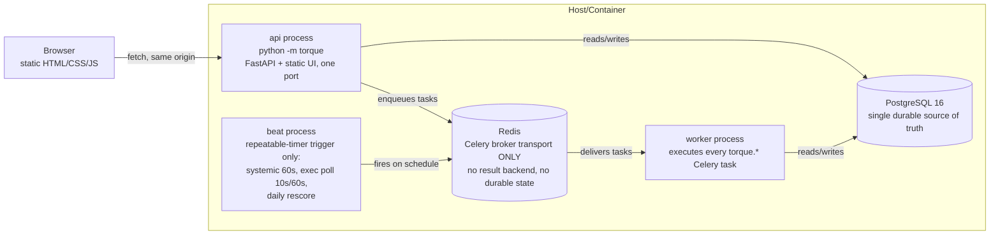
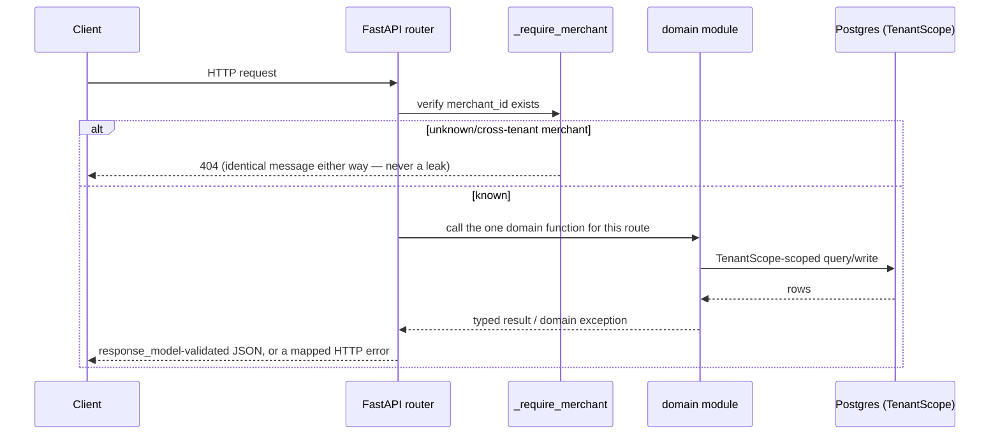
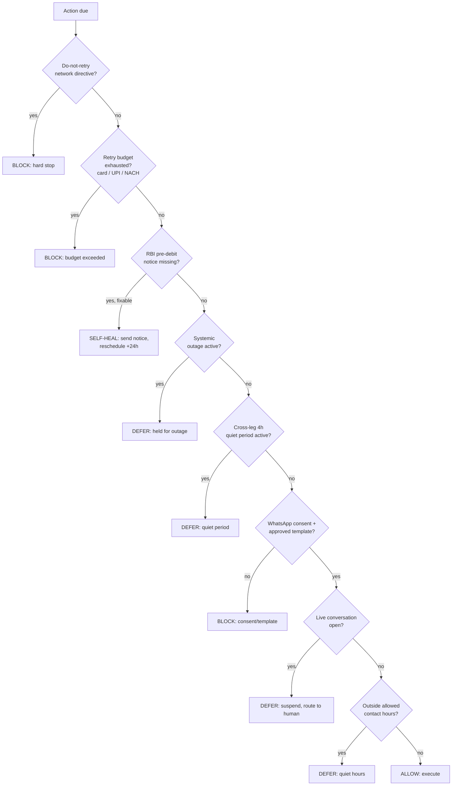
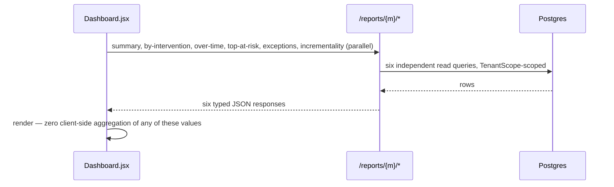

# Architecture — Deep Dive

Companion to the [root README](../../README.md#system-architecture)'s
top-level diagram. This document goes one level deeper on the two areas most
likely to draw follow-up questions: the frontend's architectural decision,
and the guardrail engine's decision procedure.

## Process topology

No task ever holds durable state in Redis — `scheduled_job` (Postgres) is the
one durable execution timer table; `beat` only fires triggers against it.

## Request lifecycle (one HTTP call)

Every router (`reporting.py`, `agent_console.py`, `ai.py`, `demo.py`,
`webhooks.py`, `checkout_injection.py`) follows this exact shape — one
`_require_merchant` guard, one call into a domain module, no business logic
in the router itself.

## Guardrail decision procedure

First-failure-wins, evaluated in this fixed order by
`torque.compliance.*`'s pure predicate functions, consulted through one
callable interface the execution layer calls before every action. Every
`BLOCK` is written as an `ACTION_BLOCKED` `CaseEvent` with its reason — this
is the data source for the dashboard's "Where Torque deliberately held back"
panel; nothing is computed retroactively.

## Frontend: the React migration — decision record

The frontend went through three phases: (1) a hand-written vanilla SPA
(`torque.js`/`torque.css`/`index.html`) for most of the project, (2) a
deliberate re-evaluation of that choice against a fifteen-point criteria
list (visual quality, component reuse, maintainability, state management,
routing, interactive visualization, responsive behavior, accessibility,
testability, development velocity, demo reliability, ability to present a
convincing AI product, migration risk, remaining time, and the actual repo
state), and (3) a full migration to **React 18 + Vite**
(`frontend/`) once that evaluation genuinely favored it — not by default,
and not merely because "vanilla was already there."

**Why vanilla held up for as long as it did.** Every interaction the product
needed — a hover-driven area chart, an interactive semicircular gauge,
citation-anchored scroll-and-flash, a live-polling activity feed, table→card
responsive transforms — is achievable in plain JS and inline SVG, and was
implemented and verified working that way across several UI/UX passes. The
actual quality problems found in those passes (generic visual hierarchy, a
missing money-flow narrative, weak component consistency) were *layout and
composition* problems, not technology problems, and were fixed without a
framework.

**Why the calculus changed.** As the UI grew — five screens now genuinely
sharing components (the priority-feed row used on both the dashboard and the
Agent Console queue; the gauge; the area chart; the AI assessment card; the
evidence/timeline/precedent trio) — the vanilla approach's costs stopped
being hypothetical:

- **Component reuse** was already emulated with named render functions
  (`feedRow()`, `confidenceRing()`, …) returning HTML strings — functionally
  a component model, but without prop typing, without a co-located
  stylesheet-per-component convention, and with manual DOM re-querying after
  every `innerHTML` replace to re-attach event listeners.
- **State management** (which case is selected, is the AI narrative loading,
  which chart bucket is active) lived in a mix of module-level `let`
  variables and DOM `dataset` attributes — workable at five screens, a real
  liability if the product grows.
- **Testability** of the old approach was static-source-string-scanning
  (`tests/test_module10_ui.py` asserted literal substrings like
  `'id="doExplain"'` existed in the shipped file) — it could prove a string
  was present, never that a state transition actually happened correctly
  (see the case-switch bug below, which static scanning would never have
  caught).

**What the migration actually changed.** `frontend/src/` now has real
component boundaries (`components/`, `pages/`, `context/`, `lib/`), React
state (`useState`/`useEffect`) instead of module-level mutable variables,
and `react-router-dom`'s `HashRouter` preserving the exact same
`#/dashboard`, `#/cases/:id`, `#/console/:id`, `#/demo` URL scheme so nothing
about the backend's contract with the frontend changed. `npm run build`
writes straight into `src/torque/ui/static/`, so `torque.api.ui` and
`torque.api.app` required **zero** changes — the backend still just serves
whatever is on disk in that directory.

**Migration risk, and what it actually surfaced.** The single highest-risk
step was porting the AI Assessment card, since it owns request state
(idle/loading/narrative/error) and citation-anchoring across a DOM subtree.
Porting it surfaced one genuine regression before it ever shipped: without
an explicit `key={caseId}` on the `AiAssessment` component, React does not
remount it on a same-route case switch (`/cases/:caseId` → a different
`:caseId` is the same route match), so its internal request state would
persist across cases — a previously-explained case's narrative could
theoretically bleed into a newly-selected case's panel for a moment. Fixed
by keying the component on `caseId`; verified live (explain case A, navigate
to case B, confirm the AI panel is idle) before being considered done. This
is exactly the kind of state-transition bug a component-scoped framework
makes both more possible to introduce *and* far easier to fix correctly (one
prop) than the vanilla equivalent (manually tracking "does this DOM
subtree's data attribute match the currently-selected case" by hand).

**What was deliberately not introduced:** a charting library (the area
chart and gauge remain hand-rolled inline SVG — no new visualization
dependency was justified by their complexity), Redux/Zustand or any global
state library (five screens, no shared mutable state complex enough to
justify one), TypeScript (a real, acknowledged tradeoff — see
[`../../learning_log.md`](../../learning_log.md) for the reasoning), and
CSS-in-JS or Tailwind (the existing design-token stylesheet was already
sound and was ported near-verbatim, preserving every visual decision from
the prior UI/UX passes rather than re-deriving them).

**The concrete guardrail against regressing on this architecture silently:**
`tests/test_module10_ui.py` and `tests/test_module9b_ui.py` now scan the
`frontend/src/` source tree (not a built/minified bundle, whose local
variable names a bundler is free to rename) for the same API-path,
no-client-side-computation, and citation-handling invariants the vanilla-era
tests enforced, plus a new assertion that no source file uses
`dangerouslySetInnerHTML` — a stronger, structurally-enforced version of the
old "remember to call `esc()`" convention, since React auto-escapes every
JSX text expression by default.

## Frontend component inventory

| File (in `frontend/src/`) | Renders |
|---|---|
| `pages/Dashboard.jsx` | Hero, money-flow pipeline, leg bars, interactive chart, incrementality card, priority feed, exceptions table |
| `pages/CaseView.jsx` | The canonical case screen — header, gauge, next-step banner, reasoning signals, AI Assessment, action rail, timeline, evidence, precedent |
| `pages/Cases.jsx` | Filterable/paginated case list |
| `pages/Console.jsx` | Human-queue priority feed |
| `pages/Demo.jsx` | Scenario buttons + live activity feed |
| `components/LoopPipeline.jsx`, `LegBars.jsx`, `AreaChart.jsx`, `Gauge.jsx`, `FeedRow.jsx`, `Evidence.jsx`, `Timeline.jsx` | Shared presentational components used across the screens above |
| `components/AiAssessment.jsx`, `Precedent.jsx`, `lib/citations.js` | The AI-assessment fetch/render/anchor pipeline |
| `context/MerchantContext.jsx`, `ToastContext.jsx` | The two pieces of cross-screen state: the active merchant id, and the toast queue |
| `lib/api.js`, `format.js`, `useAsync.js` | The API client, formatting helpers, and the data-fetching hook every page uses |

## Data flow: dashboard load

