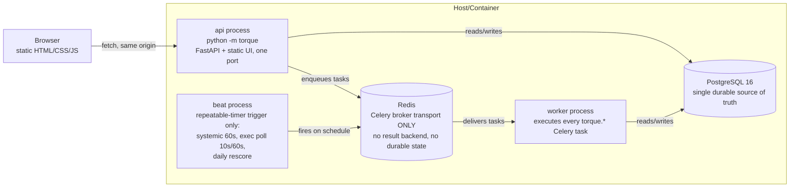
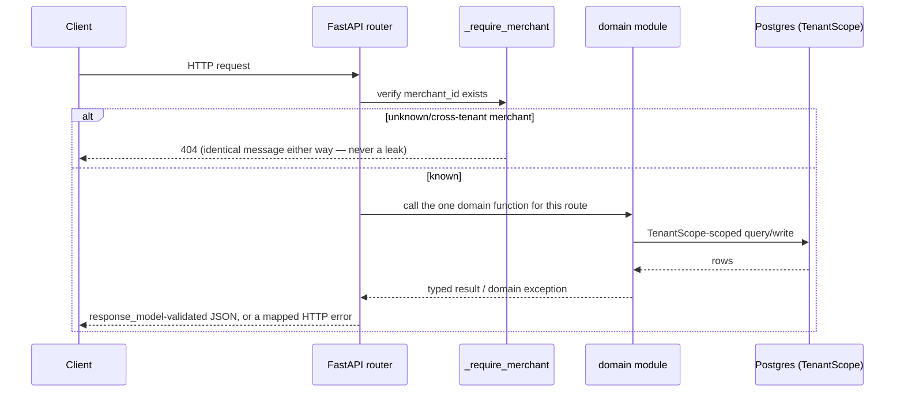
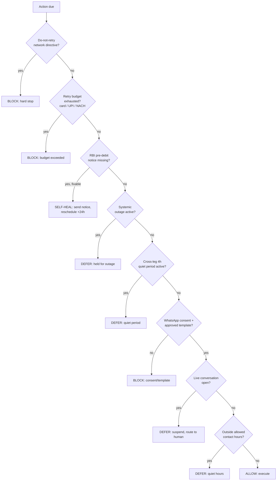
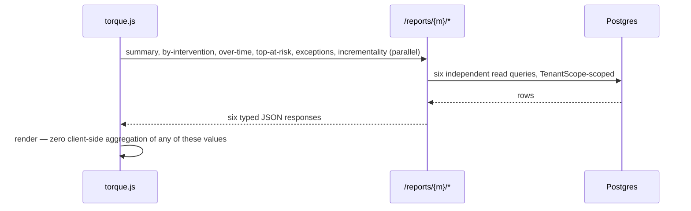

# Architecture — Deep Dive

Companion to the [root README](../../README.md#system-architecture)'s
top-level diagram. This document goes one level deeper on the two areas most
likely to draw follow-up questions: the frontend's architectural decision,
and the guardrail engine's decision procedure.

## Process topology

No task ever holds durable state in Redis — `scheduled_job` (Postgres) is the
one durable execution timer table; `beat` only fires triggers against it.

## Request lifecycle (one HTTP call)

Every router (`reporting.py`, `agent_console.py`, `ai.py`, `demo.py`,
`webhooks.py`, `checkout_injection.py`) follows this exact shape — one
`_require_merchant` guard, one call into a domain module, no business logic
in the router itself.

## Guardrail decision procedure

First-failure-wins, evaluated in this fixed order by
`torque.compliance.*`'s pure predicate functions, consulted through one
callable interface the execution layer calls before every action. Every
`BLOCK` is written as an `ACTION_BLOCKED` `CaseEvent` with its reason — this
is the data source for the dashboard's "Where Torque deliberately held back"
panel; nothing is computed retroactively.

## Frontend: why vanilla JS, and what that costs

The frontend is a hand-written SPA — `index.html` + `torque.css` +
`torque.js`, hash-routed, no build step, served by the same FastAPI process
on the same port as the API (`torque.api.ui`). This was evaluated twice
during the project (once for the initial UI/UX overhaul, once explicitly
re-asked whether a framework migration was warranted) and kept both times.
The reasoning:

**What a framework would have bought:** component-file organization,
built-in reactivity, a component ecosystem for charts/animation.

**What it would have cost:** a build step (npm/bundler) in a project whose
explicit constraint is "one command, offline, free-tier, no Node" (see the
root README's stack line); a rewrite of every existing render function under
time pressure, with real risk of a partially-migrated, partially-working
app; and — critically — none of the actual reported problems (generic
visual hierarchy, weak product storytelling, a missing money-flow narrative)
were caused by the technology. They were caused by *layout and composition*
decisions, which are exactly as fixable in vanilla JS/inline SVG as in JSX.

**What vanilla JS cannot do that a framework would help with**, honestly:
fine-grained reactive state diffing (this app instead does targeted DOM
patches — e.g. the dashboard's chart-bucket switch replaces one `
`, not
the whole page), and a component-file structure for very large component
trees (this app instead uses one file with named render functions per
component — `loopPipeline()`, `feedRow()`, `evidencePanel()`, `confidenceRing()`,
etc. — which stays legible at this app's actual size, five screens).

**The concrete guardrail against regressing on this decision silently:**
`tests/test_module10_ui.py` and `tests/test_module9b_ui.py` assert, by
scanning the shipped source, that specific API paths, specific DOM
structures, and specific escaping/error-handling patterns exist — a future
change (framework migration or otherwise) that breaks these contracts fails
the build, not just a visual review.

## Frontend component inventory

| Function (in `torque.js`) | Renders |
|---|---|
| `renderDashboard` | Hero, money-flow pipeline, leg bars, interactive chart, incrementality card, priority feed, exceptions table |
| `renderCaseView` | The canonical case screen — header, gauge, next-step banner, reasoning signals, AI Assessment, action rail, timeline, evidence, precedent |
| `renderCases` | Filterable/paginated case list |
| `renderConsole` | Human-queue priority feed |
| `renderDemo` | Scenario buttons + live activity feed |
| `loopPipeline`, `legBars`, `areaChartSvg`, `confidenceRing`, `feedRow`, `evidencePanel`, `renderNarrative`, `renderPrecedent` | Shared presentational components used across the screens above |
| `explainCase`, `focusCitation`, `citeGroup` | The AI-assessment fetch/render/anchor pipeline |

## Data flow: dashboard load

